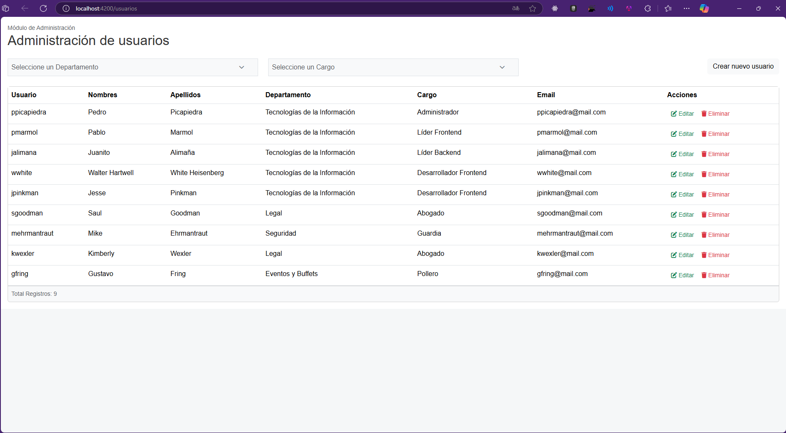
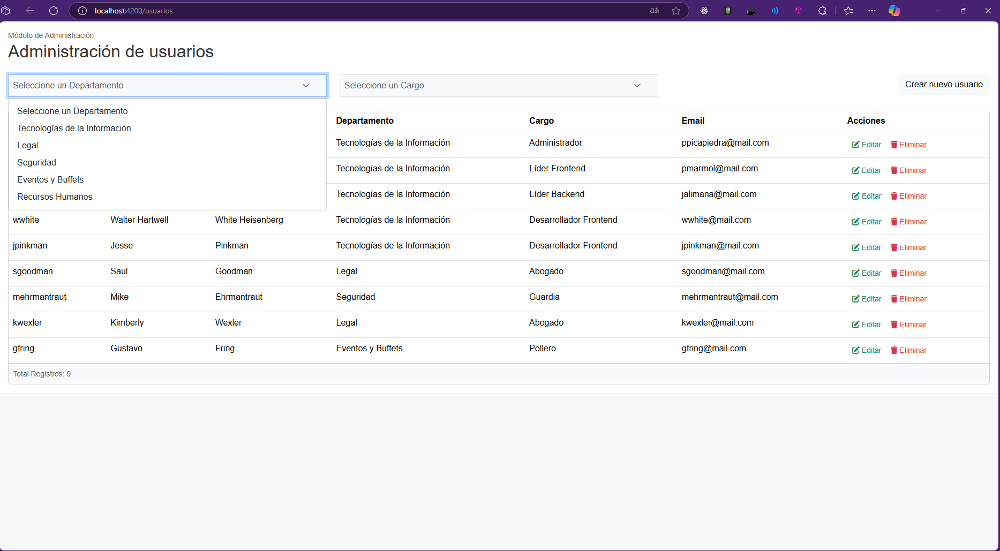
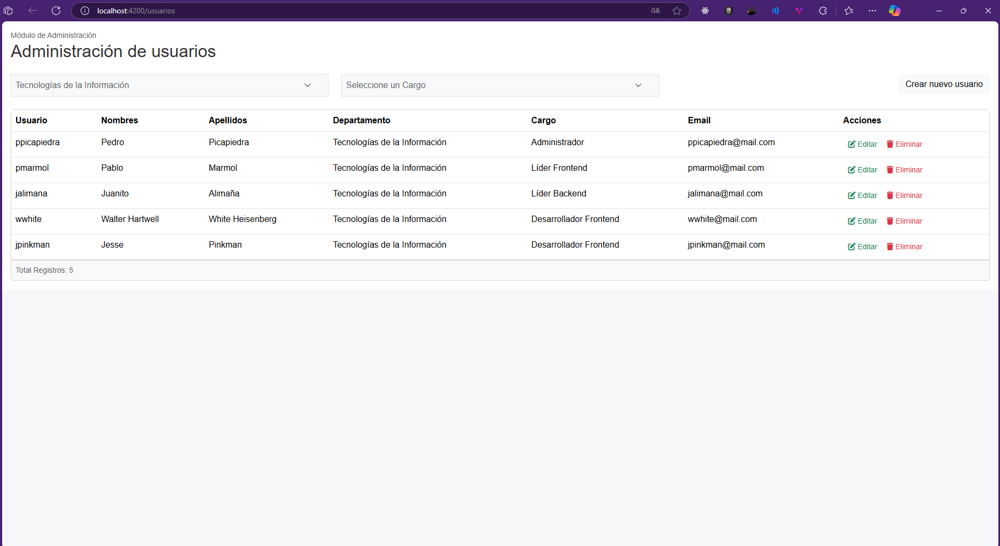
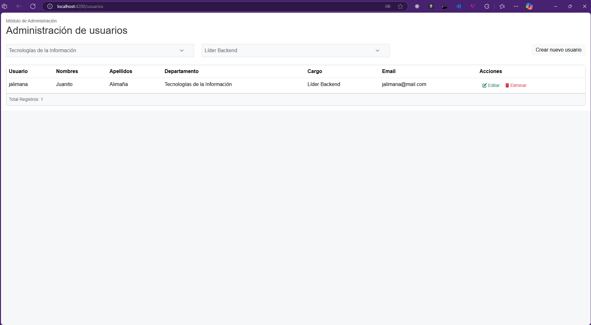
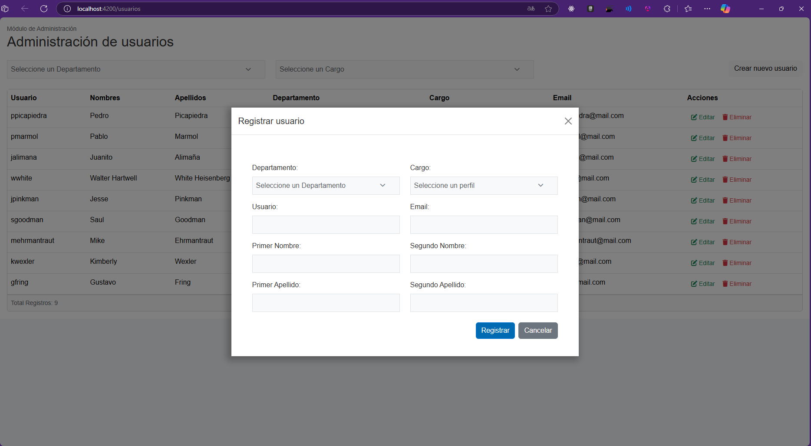
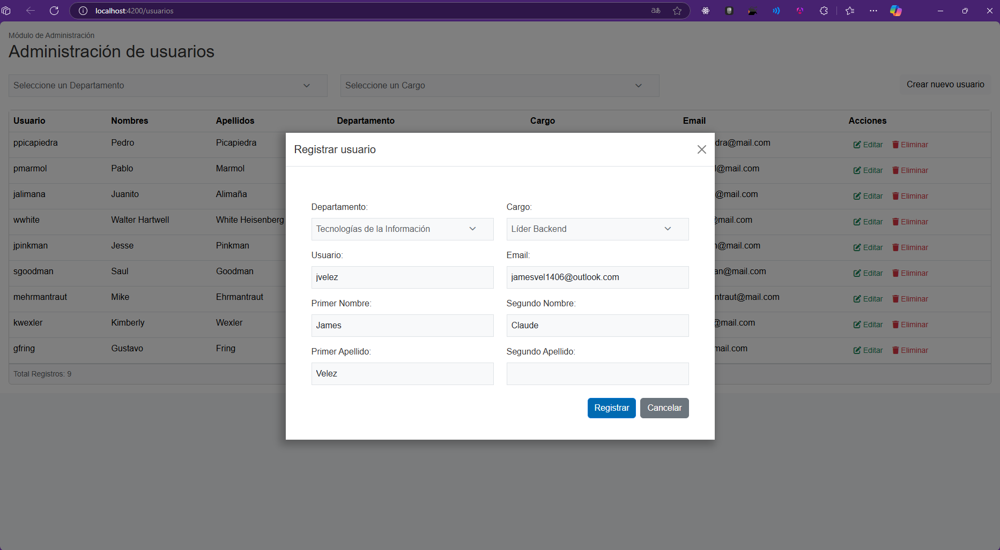
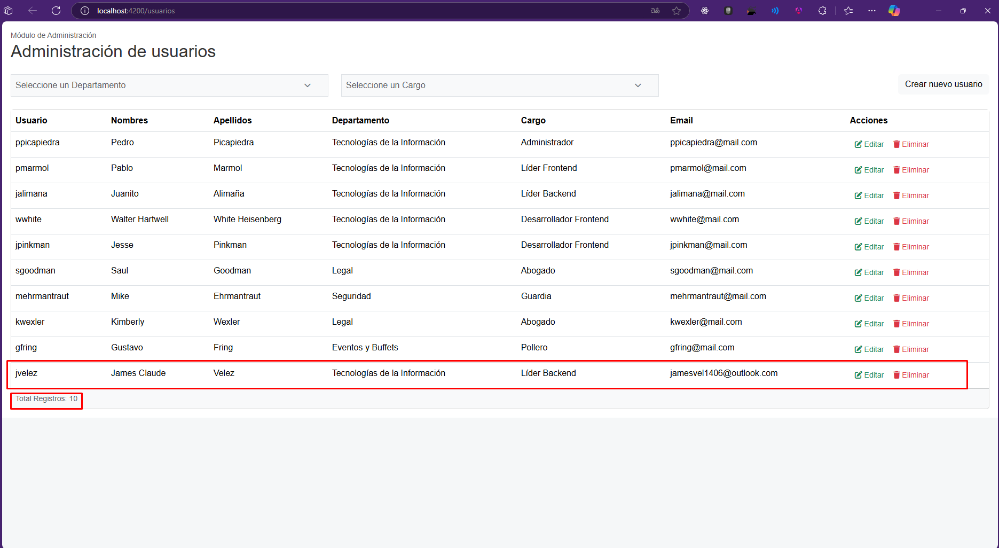
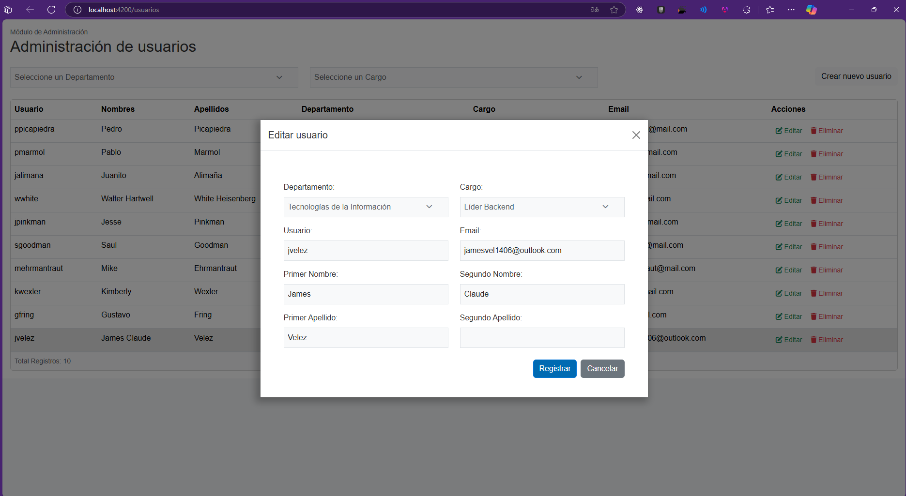
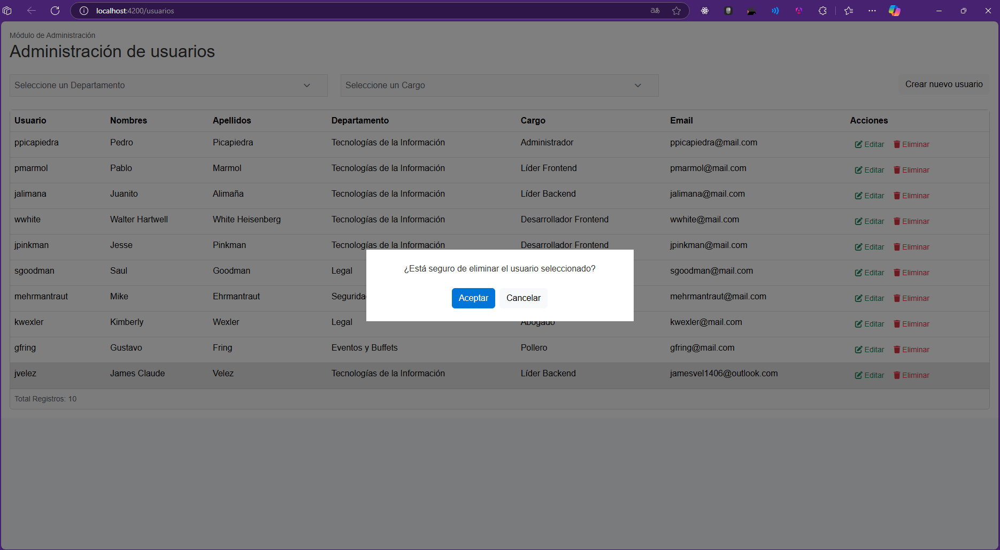
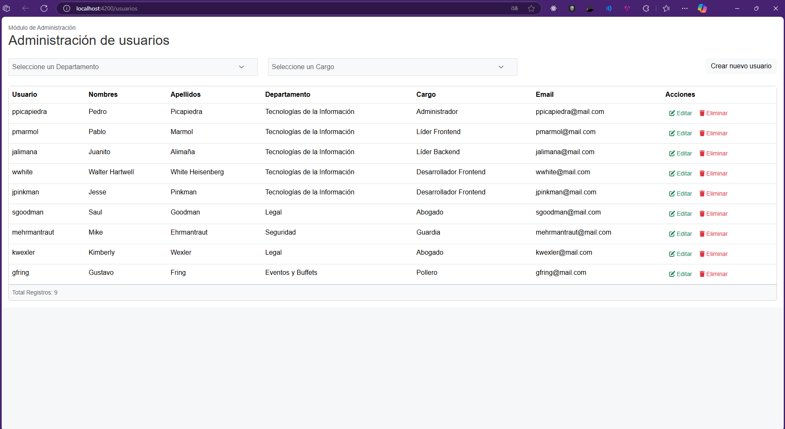

# PruebaTecnicaTT


# Instrucciones para Lanzar los Proyectos

Este repositorio contiene dos proyectos: uno desarrollado en **Laravel** y otro en **Angular**. A continuación, se explican los pasos necesarios para configurar y ejecutar ambos proyectos.

---

## Requisitos Previos

- Tener instalado [Composer](https://getcomposer.org/), [Node.js](https://nodejs.org/), y [Angular CLI](https://angular.io/cli).
- Tomar en consideración que se utiliza una versión específica de angular / Angular 16
- Contar con un servidor de base de datos compatible.
- Asegurarse de tener el archivo `CreaBD.sql` ubicado en el directorio raíz del proyecto.

---

## Pasos Iniciales

1. **Crear la base de datos:**
   Ejecuta el script SQL `CreaBD.sql` en tu gestor de base de datos para generar la estructura inicial de la base de datos.

---

## Configuración y Ejecución del Proyecto Laravel

1. Navega al directorio del proyecto Laravel:
   ```bash
   cd gestion-usuarios
   ```

2. Instala las dependencias del proyecto:
   ```bash
   composer install
   ```

3. Crea y llena las tablas de la base de datos:
   ```bash
   php artisan migrate --seed
   ```

4. Inicia el servidor:
   ```bash
   php artisan serve
   ```

El proyecto estará disponible en la URL proporcionada por el comando `php artisan serve`, usualmente `http://127.0.0.1:8000`.

---

## Configuración y Ejecución del Proyecto Angular

1. Navega al directorio del proyecto Angular:
   ```bash
   cd FrontEnd/gestion-usuarios
   ```

2. Instala las dependencias del proyecto:
   ```bash
   npm install
   ```

3. Inicia la aplicación:
   ```bash
   ng serve
   ```

Por defecto, la aplicación estará disponible en `http://localhost:4200/`.

---

## Notas Importantes

- Asegúrate de que el proyecto Laravel esté corriendo antes de iniciar la aplicación Angular, ya que probablemente Angular dependa de los servicios proporcionados por la API de Laravel.
- Modifica las configuraciones de conexión a la base de datos si es necesario, ajustando el archivo `.env` en el directorio de Laravel.

---


## Capturas de la aplicación

Aquí se muestran capturas de la aplicación en funcionamiento.

### Ejemplos de uso










